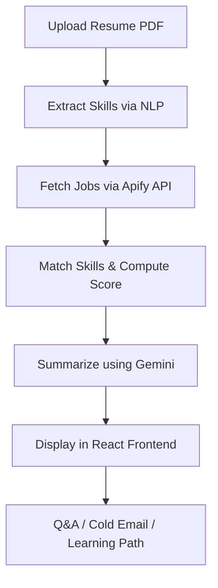

# 🚀 Career Captain – AI Resume Job Matcher & Interview Coach

> **Created by:** Prashant Sahu  
> **Email:** [prs1234hant@gmail.com](mailto:prs1234hant@gmail.com)

Career Captain is an **AI-powered career assistant** that analyzes resumes, matches them with live job postings, and provides personalized insights such as missing skills, learning pathways, cold emails, and interview Q&A — all in one intuitive platform.

It combines **Streamlit (Python)** for backend logic and **React + Tailwind + Framer Motion** for a next-gen, responsive frontend interface.

---

## 🌟 Features

### 🧠 AI-Driven Analysis
- Extracts skills from uploaded resumes.
- Matches candidate skills with live job listings from **Naukri (via Apify)**.
- Highlights **matched** and **missing** skills for each job.

### 🧾 Smart Summaries
- Uses **Google Gemini 2.5 Flash API** to generate professional skill summaries.

### 🎯 Interview & Learning Tools
- Auto-generates **interview questions** and **answers** using LLMs.
- Suggests **learning pathways** for missing skills.
- Offers a **cold-email generator** to contact recruiters directly.

### 🔐 User Management
- Signup / Login with secure password hashing.
- Personalized search history stored in SQLite.

### 💼 Interactive Frontend
- Fully responsive **React + Tailwind UI**.
- Elegant hover animations and transitions (Framer Motion).
- Separate pages for:
  1. **Login / Signup**
  2. **Job Search**
  3. **AI Results & Actions**

---

## 🧩 Project Structure

### 🔙 Backend (`/backend`)

| File | Description |
|------|--------------|
| `auth.py` | Handles signup/login with SHA-256 hashing. |
| `database.py` | Manages SQLite database initialization and search history. |
| `resume_job_parser.py` | Parses resumes and extracts skills. |
| `gemini_helper.py` | Interfaces with Google Gemini API for text generation. |

### 🐍 Main Engine (`main.py`)
Core Python logic:
- Fetches job listings from **Apify (Naukri Scraper)**.  
- Matches resumes → jobs.  
- Summarizes results via Gemini.  
- Stores searches in database.

### 🎨 Frontend (React)
Located in `/frontend/`:

```
frontend/
├── src/
│   ├── components/
│   │   ├── CareerCaptain.jsx    # Main app interface
│   │   ├── Navbar.jsx           # Top navigation
│   │   ├── LoginForm.jsx        # Authentication component
│   │   └── JobCard.jsx          # Job result UI component
│   ├── api/
│   │   └── api.js               # Fetch functions to backend endpoints
│   ├── App.js                   # Root component
│   ├── index.css                # Tailwind base styles
│   └── main.jsx                 # React entry point
├── public/
└── package.json
```

---

## ⚙️ Tools & Technologies

| Category | Tools |
|-----------|-------|
| **Frontend** | React 18, Tailwind CSS, Framer Motion, Lucide React, Vite |
| **Backend** | Python 3.10+, Streamlit, SQLite 3, Apify Client, Google Gemini API |
| **AI / ML Models** | Gemini 2.5 Flash (Model by Google) |
| **APIs & Services** | Apify Naukri Job Scraper, Google Generative AI SDK |
| **Version Control & Deployment** | Git, GitHub, Streamlit Cloud / Vercel / Render |
| **Authentication** | Custom SHA-256 based hash (login/signup) |
| **UI Design** | Tailwind CSS + Framer Motion for animations |

---

## 🧠 Workflow Overview



---

## 🛠️ Installation & Setup

### 🔹 Backend (Streamlit)
1. Clone repo and open backend directory:
   ```bash
   git clone https://github.com/prashantsahu-ai/career-captain.git
   cd career-captain/backend
   ```

2. Create & activate virtual environment:
   ```bash
   python -m venv career
   source career/bin/activate       # macOS/Linux
   career\Scripts\activate          # Windows
   ```

3. Install dependencies:
   ```bash
   pip install -r requirements.txt
   ```

4. Run the app:
   ```bash
   streamlit run front.py
   ```

---

### 🔹 Frontend (React)
1. Go to frontend folder:
   ```bash
   cd ../frontend
   ```

2. Install packages:
   ```bash
   npm install
   ```

3. Start development server:
   ```bash
   npm run dev
   ```

4. Open in browser:
   ```
   http://localhost:5173
   ```

---

## 🔌 Backend API Routes

| Endpoint | Method | Description |
|-----------|--------|-------------|
| `/api/match` | POST | Uploads resume & finds matching jobs |
| `/api/questions` | POST | Generates interview questions |
| `/api/answer` | POST | Generates answer for a question |
| `/api/cold_email` | POST | Creates recruiter cold email |
| `/api/suggest` | POST | Suggests learning paths |
| `/api/summarize` | POST | Summarizes matched vs missing skills |

---

## 🧩 Database Schema

**SQLite:** `career_captain.db`

**Tables**
- `users(email TEXT PRIMARY KEY, password TEXT NOT NULL)`
- `searches(id INTEGER PRIMARY KEY AUTOINCREMENT, user_email TEXT, keywords TEXT, location TEXT, job_title TEXT, company TEXT, matched_skills TEXT, missing_skills TEXT, summary TEXT, created_at TIMESTAMP DEFAULT CURRENT_TIMESTAMP)`

---

## 🎨 UI Overview

| Section | Description |
|----------|-------------|
| **Login / Signup** | Authenticates users and creates profiles. |
| **Dashboard** | Upload resume, set keywords, and fetch matching jobs. |
| **Results Page** | Interactive job cards with progress bars, skill summaries, and AI actions. |
| **Q&A Panel** | Expandable cards showing interview questions and AI answers. |
| **Cold Email Generator** | Generates recruiter email drafts based on role. |

---

## 💡 Future Enhancements
- OAuth (Google Login)
- Chat-based AI Career Mentor
- Job Alert Notifications
- Integration with LinkedIn API / Indeed API
- Dashboard Analytics for Skill Trends

---

## 🧾 License
This project is open-sourced under the **MIT License**.  
You’re free to modify, distribute, and use it for learning or professional purposes.

---

## 👨‍💻 Author

**Prashant Sahu**  
📧 [prs1234hant@gmail.com](mailto:prs1234hant@gmail.com)  
💼 AI Engineer & Full-Stack Developer  
💡 Passionate about building real-world AI tools that simplify human decision-making.

---

> *“Career Captain empowers professionals to find smarter career paths, powered by AI.”*
